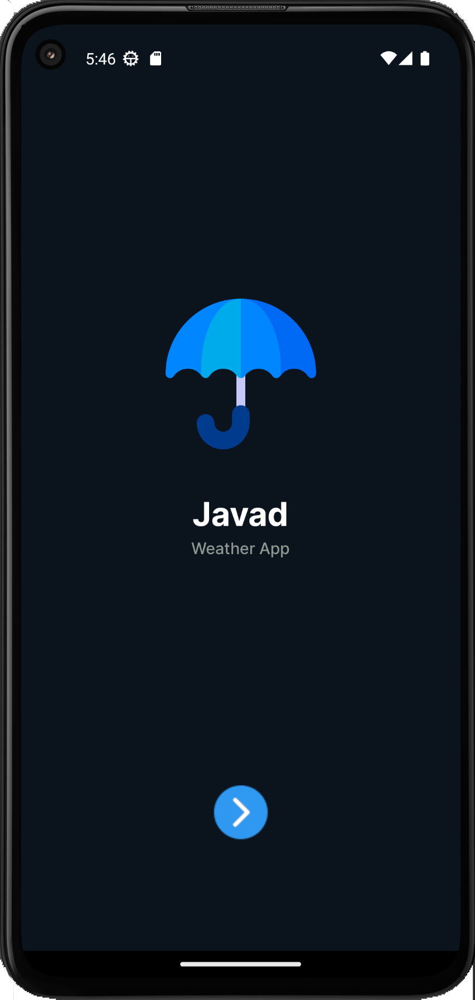
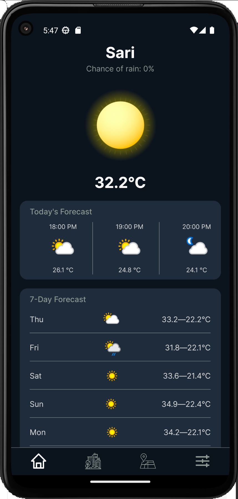
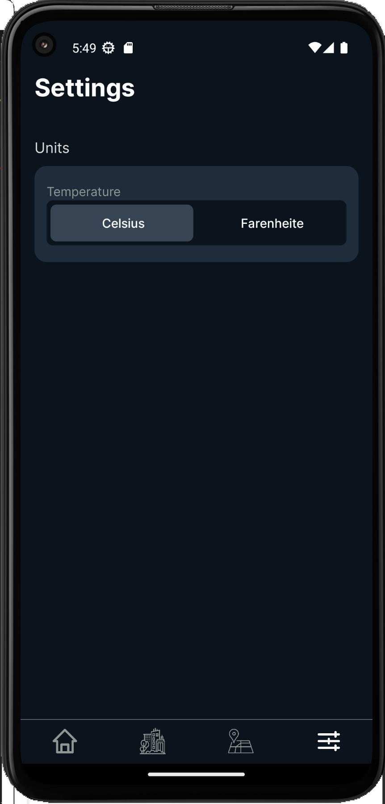
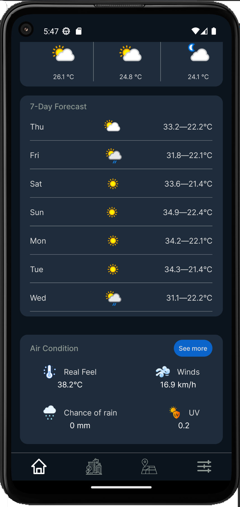
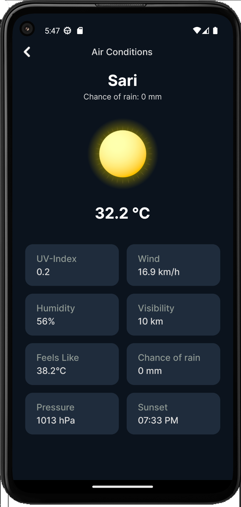
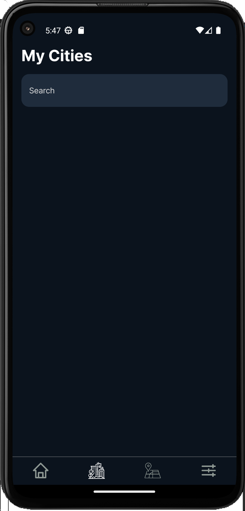
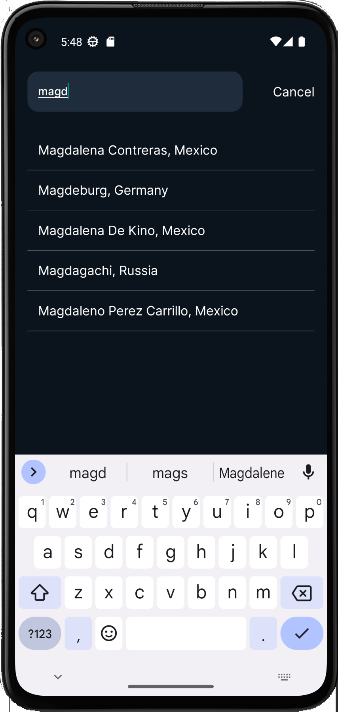
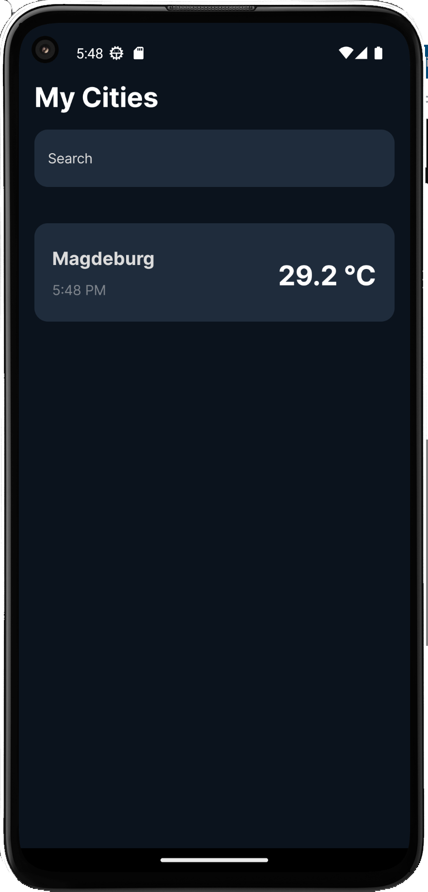

# 🌦️ Weather App


A modern and customizable **React Native Weather App** with real-time weather updates, hourly & weekly forecasts, UV index, wind speed, humidity, and more.

## 📝 Project Description

This is a modern weather application built with **React Native**.  
It provides real-time weather updates for your current location as well as any city worldwide.  
The app features a clean design with multiple screens including splash, home, search, map, and settings.  

Users can:
- View detailed weather information (hourly, daily, UV index, wind, humidity, etc.)
- Search for different cities
- Explore weather on an interactive map
- Customize their experience in the settings screen

---
## ✨ Screenshots









## ✨ Features

- 📱 **Splash Screen** – simple and modern entry screen.
- 🏠 **Home Screen** – shows weather for your current city with:
  - Hourly forecast
  - 7-day forecast
  - UV Index, Wind, Humidity, etc.
  - **See More** button to expand details.
- 🔍 **Search Screen** – search for weather in other cities.
- 🗺️ **Map Screen** – visualize weather directly on the map.
- ⚙️ **Settings Screen** – customize your app experience.

---


## 🚀 Tech Stack

- **React Native 0.80.2**
- **React 19**
- **React Navigation**
- **Redux Toolkit**
- **Axios** (for API calls)
- **Moment.js**
- **React Native Maps**
- **MMKV Storage**

---

## 📦 Installation

Clone the repository:

```bash
git clone https://github.com/your-username/weather-app.git
cd weather-app

Install dependencies:

npm install


or

yarn install


Start the Metro bundler:

npm start


Run on Android:

npm run android


Run on iOS:

npm run ios

⚙️ Configuration

The app requires a Weather API key (e.g. OpenWeatherMap
).

Create a .env file in the root directory and add:

WEATHER_API_KEY=your_api_key_here

🧪 Scripts

npm run android → Run on Android

npm run ios → Run on iOS

npm run start → Start Metro bundler

npm run lint → Run ESLint

npm run test → Run Jest tests

📄 License

This project is licensed under the MIT License.
Feel free to fork, modify, and use it for personal or commercial projects.
```
